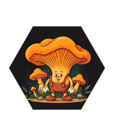

<!-- README.md is generated from README.Rmd. Please edit that file -->

```{r, include = FALSE}
knitr::opts_chunk$set(
  collapse = TRUE,
  comment = "#>",
  fig.path = "man/figures/README-",
  out.width = "100%"
)
```

# fungai 

<!-- badges: start -->
<!-- badges: end -->

{fungai} has been given additional knowledge of over 200+ mushroom species, it also happens to be a mushroom. fungai is a friendly ai that helps identify mushrooms and describe them (but never eat them). 

## Installation

You can install the development version of fungai like so:

``` r
pak::pak("frankiethull/fungai")
```

### Examples

These are basic examples which show you how to use fungai:

using a prompt with information you have about the mushroom:
```{r example, cache=TRUE}
library(fungai)

fungai::fungai(llm_model = "llama3.2-vision",
               prompt    = "hello fungai,
                         I'm trying to identify an orange mushroom that has no gills.
                         it has gill-like ridges, but i think it's a polypore.
                         i found it growing out of the ground in the woods.
                         Cap 5 cm across, stem 7 cm tall * 1 cm thick, 
                         can you reference your dictionary and help me identify it?"
               ) |> cat()
```


using an image of the mushroom:
```{r, cache=TRUE}

image <- ellmer::content_image_file(
                             path   = system.file("images", "6.png", package = "fungai"), 
                             resize = "low"
                             )

fungai::fungai(llm_model = "llava",
               prompt    = image
               ) |> cat()
```

more generic mushroom questions:
```{r, cache=TRUE}
fungai::fungai(llm_model = "phi4", 
               prompt    = "hello fungai! what mushrooms are found in the US Rocky Mountains?"
               ) |> cat()
```


```{r, cache=TRUE}
fungai::fungai(llm_model = "llama3.3", 
               prompt    = "hello fungai! can you give me a cool new mycelium catch phrase?"
               ) |> cat()
```

sharing fungai thoughts between different models:
```{r, cache=TRUE}

fungai::fungai(llm_model = "phi4",
               prompt    = "write a few mushroom puns, 
                            ask yourself which is the best") |>
  fungai::fungai(llm_model = "llama3.3",
                 prompt = _)

```


