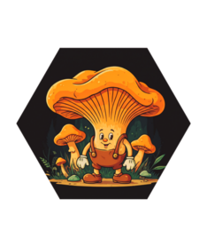

<!-- README.md is generated from README.Rmd. Please edit that file -->

# fungai 

<!-- badges: start -->
<!-- badges: end -->

{fungai} has been given additional knowledge of over 200+ mushroom
species, it also happens to be a mushroom. fungai is a friendly ai that
helps identify mushrooms and describe them.

## Installation

You can install the development version of fungai like so:

``` r
pak::pak("frankiethull/fungai")
```

### Examples

These are basic examples which show you how to use fungai:

using a prompt with information you have about the mushroom:

``` r
library(fungai)

fungai::fungai(llm_model = "llama3.2-vision",
               prompt    = "hello fungai,
                         I'm trying to identify an orange mushroom that has no gills.
                         it has gill-like ridges, but i think it's a polypore.
                         i found it growing out of the ground in the woods.
                         Cap 5 cm across, stem 7 cm tall * 1 cm thick, 
                         can you reference your dictionary and help me identify it?"
               ) |> cat()
#> A mystery mushroom awaits!
#> 
#> First, let's review the characteristics:
#> 
#> * No distinct gills
#> * Gill-like ridges (also known as pseudogills or pseudo-poroid tissue)
#> * Polypore-like appearance
#> * Growing out of the ground in woods
#> * Cap: 5 cm across
#> * Stem: 7 cm tall x 1 cm thick
#> 
#> To tackle this, I'll rely on my knowledge and some trusted field guides. There are many possibilities within the polypore family (Phallomycetidae), but I'll focus on some species that match these characteristics.
#> 
#> Some common polypores with pseudo-gills or ridges include:
#> 
#> * **Polyporus varius**: This North American species can have a range of cap sizes, and its pseudoglls can resemble gill-like structures. However, its stem is typically thicker (2-4 cm) than the 1 cm you mentioned.
#> * **Laetiporus sulphureus** (Sulphur Shelf): This polypore is known for growing directly out of the ground, and it has a fan-shaped or semicircular cap with ridges that resemble gills. The stem can be up to 10 cm tall x 1-3 cm thick.
#> * **Inonotus hispidus** (Hairy Bracket): This one has pseudo-glls on its underside and can grow out of the ground in forests. The cap is typically 5-15 cm across, which could match your measurement.
#> 
#> To help narrow it down, I have a few questions:
#> 
#> 1. Can you describe the coloration of the mushroom? Is there any distinctive staining or tint?
#> 2. Are the pseudo-gills more like narrow ridges (Laetiporus or Inonotus-like) or are they broader and flatter (like some Polyporus species)?
#> 3. Has the polypore any notable features, such as an annulus (ring on stem), a bulbous base, or unusual texture?
#> 
#> By gathering more details, I can better guide you in your mushroom sleuthing adventure!
```

using an image of the mushroom:

``` r
fungai::fungai(llm_model = "llama3.2-vision",
               prompt    = ellmer::content_image_file(
                             path   = system.file("images", "6.png", package = "fungai"), 
                             resize = "high"
                             )
               ) |> cat()
#> Can I identify this mushroom? Is it poisonous?
#> 
#> Step 1: Identify the features of yellow-orange-gilled mushrooms that are often mistaken for chanterelles. 
#> 
#> Here the features are: large, cone-shaped cap; white to light orange pores.
#> 
#> Step 2: Look at how wide the stems are compared to their height.  
#> 
#> In this photo they appear as long white cylinders. The stems in Chanterelles may or may not have a partial veil, and these do not appear on Chanterelle stems.
#> 
#> Step 3: Chanterelles can be confused with False Chanterelles (Hygrophorus speciosus) of which the following characteristics apply:
#> 
#> * Large, cone-shaped cap
#> * A whitish color at the cap margins that turns to peach or yellow towards the edge.
#> * A whitish margin on a young false chanterelle; its white surface may become gray and even purplish with age. In contrast the stems appear white throughout.
#> 
#> Step 4: The False Chanterelles often form clusters in association with birch trees, sometimes with mushrooms of varying shapes and maturity.
#> 
#> The mushrooms in this image seem to be from several different fungi, which may make it difficult to identify them.
#> 
#> Step 5: If a mushroom has pores rather than teeth or gills at the underside of its cap  it is an order Agaricomycetidae, family Hygrophoraceae. They tend to grow in clusters associated with oaks or beeches. The stem has no partial veil. The cap can grow from almost black when young to a light peach color at maturity. It has white flesh and white gills.
#> 
#> Step 6: A mushroom called False Chanterelle (Hygrophorus speciosus) grows on both sides of the Atlantic Ocean, in Europe, North America. Its white flesh often smells very pungent like apricot nectar. Its cap grows from 10 to 13 cm across and a height of nearly twice that tall.
#> 
#> Step 7: The mushroom you posted appears to have yellow gills. Yellow colors on a cap are often characteristic of Amanita species. They commonly grow from soil in association with tree roots. Many edible amanitas will be confused with poisonous ones, so please consult an expert before eating them; never take more than one bite as symptoms develop.
#> 
#> Step 8: One mushroom similar to False Chanterelle has pores rather than gills:
#> 
#> * The genus Craterellus.
#> * It grows from both the ground and dead wood. 
#> * Grows in groups; their young fruit bodies often remain underground covered by matted leaves for several months before emerging with a yellowish-brick cap.
#> 
#> It must be noted that mushrooms can grow to different sizes depending on where they grew and what they were competing against. This mushroom seems to be 7-11 cm tall and between 3 and 6 cm wide, which means it could be the False Chanterelle. If this is your finding, please exercise extreme caution when handling fungi, as there’s always the possibility of an allergic reaction.
#> 
#> Step 9: There are thousands of fungal species in North America with varying shapes, including:
#> 
#> * Conical caps
#> * White and black-spored gills
#> * No stem or very short stem
#> 
#> There is no way this photo alone could definitively identify any mushroom.
```

more generic mushroom questions:

``` r
fungai::fungai(llm_model = "llama3.3", 
               prompt = "hello fungai! what mushrooms are found in the US Rocky Mountains?")
#> [1] "The Rocky Mountains offer a diverse range of habitats for various mushroom species. Here are some common ones you might find:\n\n**Edible Mushrooms:**\n\n1. **Chanterelle (Cantharellus cibarius)**: Fruity, apricot-like aroma and peach-colored flesh.\n2. **Boletes (Boletus spp.)**: Various species, including the prized King Bolete (Boletus edulis).\n3. **Morels (Morchella spp.)**: Honeycomb-like appearance, often found in burn areas or near streams.\n4. **Oyster Mushrooms (Pleurotus ostreatus)**: Growing on trees, stumps, or decaying wood.\n5. **Pine Mushrooms (Tricholoma magnivelare)**: Found under pine trees, with a sweet, nutty flavor.\n\n**Poisonous Mushrooms:**\n\n1. **Destroying Angel (Amanita virosa)**: Highly toxic, resembling a large, white button mushroom.\n2. **False Morel (Gyromitra esculenta)**: Contains a toxin that can cause vomiting and other symptoms.\n3. **Conocybe filaris**: A small, bell-shaped mushroom that's highly toxic.\n\n**Other Notable Mushrooms:**\n\n1. **Lion's Mane (Hericium erinaceus)**: A unique, cascading mushroom with a seafood-like flavor.\n2. **Turkey Tail (Trametes versicolor)**: A common, colorful bracket fungus with potential medicinal properties.\n3. **Puffballs (Lycoperdon spp.)**: Various species, including the giant puffball (L. giganteum).\n\nPlease keep in mind that mushroom identification requires expertise and caution. Some species can be toxic or even deadly if ingested, so it's essential to:\n\n1. Research thoroughly before foraging.\n2. Consult with experienced mycologists or field guides.\n3. Avoid eating mushrooms that are past their prime or have been contaminated.\n\nRemember, always prioritize your safety and the environment when foraging for wild mushrooms.\n\nWould you like to know more about a specific species or region within the Rocky Mountains?"
```

``` r
fungai::fungai(llm_model = "llama3.3", 
               prompt = "hello fungai! can you give me a cool new mycelium catch phrase?")
#> [1] "My friend, I've got a few fun-gi options for you!\n\nHere are some mycelium-inspired catchphrases:\n\n1. **\"Spread the spores, spread the love!\"** \n2. **\"Mycelium minds think alike!\"** \n3. **\"We're all connected, hyphae-style!\"** (hyphae being the branching filaments that make up mycelium)\n4. **\"Fungal futurism, now!\"**\n5. **\"The mycelium is mightier than the sword!\"** \n6. **\"Infecting the world with awesomeness, one spore at a time!\"**\n7. **\"Myco-momentum: growing stronger every day!\"** (myco- being short for mycology, the study of fungi)\n8. **\"Spreading like mycelium, but without the decay (hopefully)!\"\n\nPick your favorite, or feel free to modify them to create your own unique mycelium catchphrase!\n\nWhich one do you like best? Do you have any specific ideas or themes in mind for your catchphrase? I'm here to help!"
```
